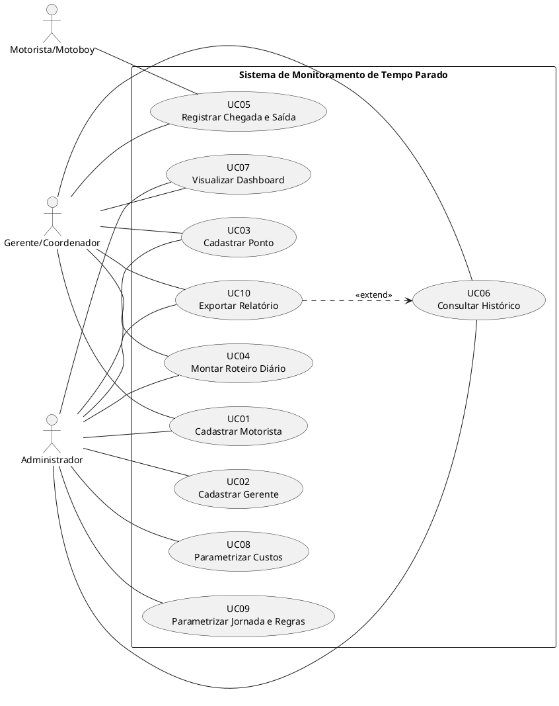
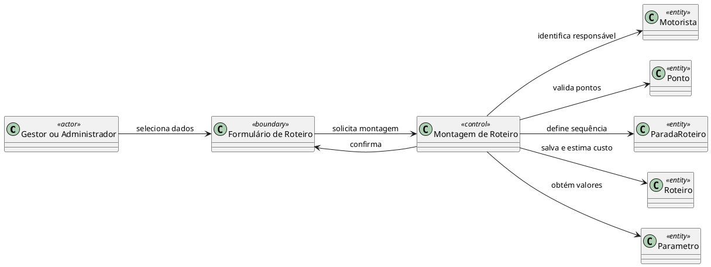
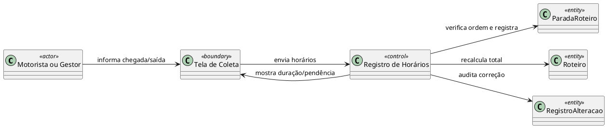
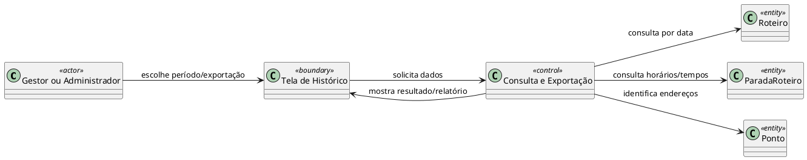
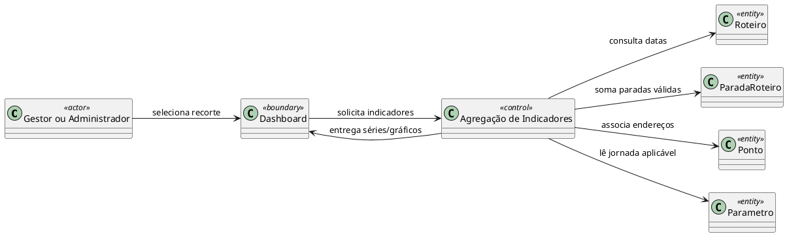
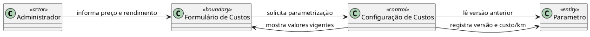
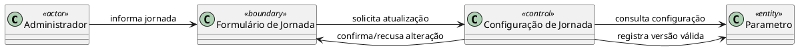
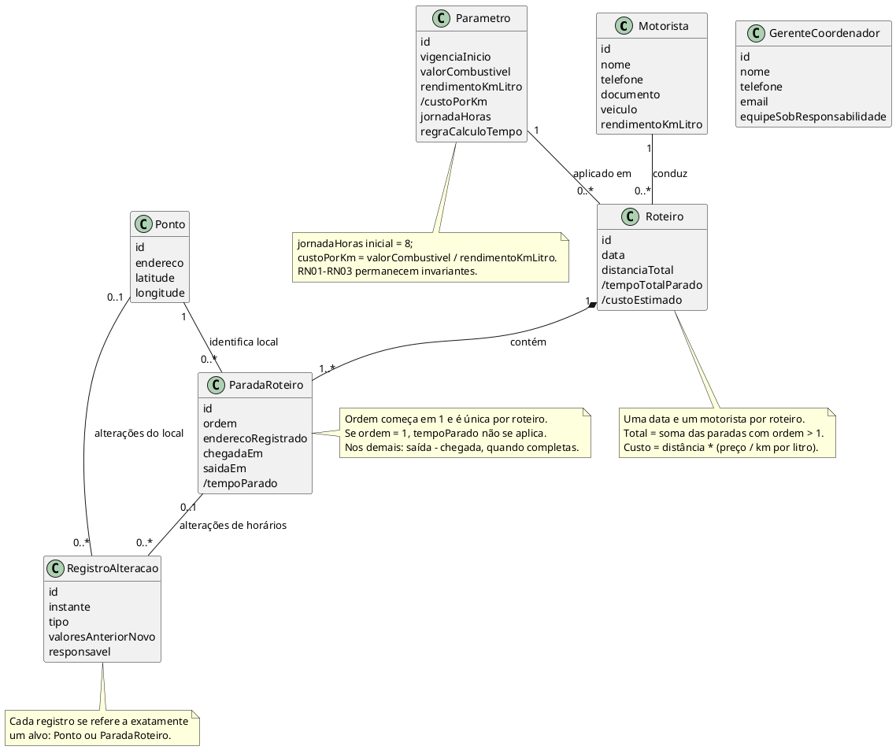

# Projeto Preliminar — Sistema de Monitoramento de Tempo Parado em Roteiros

**Engenharia de Software II — 1ª parte do trabalho avaliativo**  
**Base:** *Especificação de Requisitos — Trabalho2.pdf*, Prof. Sandro Laudares, pp. 1–5.  
**Escopo deste documento:** análise preliminar; não é especificação de implementação.

## 1. Entendimento do sistema

### 1.1 Resumo, objetivo e limites

O sistema registra roteiros diários de profissionais de campo, com pontos ordenados e horários de chegada e saída. Calcula o tempo de parada em cada ponto a partir do segundo e o total por roteiro; permite consultar histórico associado a endereços e visualizar gráficos por dia, mês e período. Também mantém parâmetros de jornada e custos e calcula o custo **estimado** do trajeto a partir de distância, combustível e rendimento do veículo.

O limite do sistema abrange cadastro de profissionais, gestores, pontos e roteiros; coleta manual dos horários; consultas, gráficos, exportação e parametrização. A interface prevista é web responsiva. **Não estão no MVP:** roteirização ou otimização automática; folha de pagamento ou ERP; telemetria embarcada em tempo real; aplicativo nativo publicado em lojas. O PDF menciona “entrada de pedidos” e identificação de endereços na seção de entregáveis, mas não define cadastro, estados ou processamento de pedidos; neste modelo, os endereços são associados aos pontos do roteiro, sem inventar um subsistema de pedidos.

### 1.2 Atores e funcionalidades

| Ator | Fundamento e responsabilidade | Casos usados nesta proposta |
|---|---|---|
| Motorista/Motoboy | Perfil de RNF04; responsável por um roteiro diário conforme RN05 e pela coleta de horários na interface web móvel. | UC05. |
| Gerente/Coordenador | Cadastro em RF02 e perfil em RNF04; acompanha equipe, prepara roteiros e analisa resultados. | UC01, UC03–UC07, UC10; UC05 para correções autorizadas. |
| Administrador | Perfil explicitamente exigido em RNF04; administra cadastros, parâmetros e consultas. | UC01–UC04, UC06–UC10. |

**Decisão de modelagem:** o documento oficial não distribui permissões por operação. A matriz acima delimita uma proposta mínima; o motorista registra os horários de seus roteiros, o gestor pode corrigir dados com auditoria, e o administrador mantém parâmetros e cadastros. Alterações na matriz exigem validação com o professor/cliente. Não há ator externo: nem ERP, nem serviço de mapas, nem sistema de telemetria são exigidos.

### 1.3 Regras e decisões necessárias

| Regra | Aplicação |
|---|---|
| RN01 | A ocorrência de ordem 1 é partida; pode ter horários registrados por RF05, mas não gera tempo parado. |
| RN02 | Nos demais pontos, duração = data/hora de saída − data/hora de chegada. |
| RN03 | Total do roteiro = soma das durações das ocorrências com ordem maior que 1. |
| RN04 | Jornada padrão inicial de 8 h/dia; referência percentual de tempo parado. |
| RN05 | Cada roteiro está vinculado a exatamente um motorista e uma data. |
| RN06 | Cada ocorrência de ponto tem uma posição sequencial única no roteiro. |
| RN07 | Custo estimado = distância percorrida × (valor do combustível ÷ rendimento em km/l). |

**Decisão de modelagem — Ponto × Parada no Roteiro.** O PDF agrupa endereço, coordenadas, ordem e horários em “Ponto”. Para permitir cadastrar e reutilizar o mesmo endereço em dias distintos sem misturar horários, este projeto mantém `Ponto` como local cadastrado e cria `ParadaRoteiro` para ordem, chegada, saída e duração. Todos os dados indicados pelo professor permanecem representados.

**Decisão de modelagem — endereço histórico.** A ocorrência guarda `enderecoRegistrado`, cópia conceitual do endereço usado naquele roteiro. Uma edição posterior em `Ponto` fica auditada e não reescreve a identificação de endereços nos históricos antigos.

**Decisão de modelagem — distância.** O documento exige distância percorrida, mas não define como obtê-la. O UC04 prevê informá-la quando conhecida; sua medição/origem deve ser definida futuramente. O modelo não pressupõe cálculo geográfico automático.

**Decisão de modelagem — custo por km.** O valor `custoPorKm` é um parâmetro **derivado** de `valorCombustivel / rendimentoKmLitro`; alterar preço ou rendimento o atualiza, sem editar código. Assim, RF09 é contemplado sem permitir que um custo por km divergente viole RN07. Se o professor exigir edição independente desse terceiro campo, é preciso esclarecer qual parâmetro prevalece; não há precedência definida na fonte.

**Decisão de modelagem — parâmetros e histórico.** Uma configuração aplicada a um roteiro permanece identificável mesmo que novos parâmetros sejam cadastrados. Isso evita que um ajuste futuro modifique retrospectivamente o custo estimado e os percentuais históricos. O modelo apresenta `Parametro` com vigência/identificação de versão, sem impor uma tecnologia.

**Ponto aberto — RF10.** “Parametrizar regras de cálculo” não especifica quais variações são permitidas. É possível manter parâmetros e valores da jornada editáveis, mas as RN01–RN03 continuam invariantes. O projeto não inventa limiares, arredondamentos ou formas alternativas de calcular duração. Uma alteração dessas regras exigiria especificação complementar.

## 2. Versão consolidada para entrega

### 2.1 Atores e catálogo de casos de uso

Os atores e suas responsabilidades estão definidos na seção 1.2. A decomposição abaixo mantém as operações automáticas dentro dos objetivos iniciados por pessoas: calcular a duração é parte de **Registrar Horários**, e calcular custo é parte de **Montar Roteiro** quando há dados suficientes. Nenhum “ator Sistema” é criado.

| ID | Caso de uso | Atores | Requisitos | Regras |
|---|---|---|---|---|
| UC01 | Cadastrar Motorista/Motoboy | Gerente, Administrador | RF01 | — |
| UC02 | Cadastrar Gerente/Coordenador | Administrador | RF02 | — |
| UC03 | Cadastrar Ponto | Gerente, Administrador | RF03 | — |
| UC04 | Montar Roteiro Diário | Gerente, Administrador | RF04, RF11 | RN05–RN07 |
| UC05 | Registrar Chegada e Saída | Motorista; Gerente para correção | RF05, RF06 | RN01–RN03, RN06 |
| UC06 | Consultar Histórico | Gerente, Administrador | RF07 | RN01–RN03, RN05–RN06 |
| UC07 | Visualizar Dashboard | Gerente, Administrador | RF08 | RN01–RN04 |
| UC08 | Parametrizar Custos | Administrador | RF09, RF11 | RN07 |
| UC09 | Parametrizar Jornada e Regras | Administrador | RF10 | RN01–RN04 |
| UC10 | Exportar Relatório do Período | Gerente, Administrador | RF12 | RN01–RN03 |

**Relacionamento UML:** UC10 é uma extensão **opcional** de UC06 no ponto de extensão “resultado do período exibido”: consultar não obriga exportar. Não há `<<include>>` obrigatório entre os demais casos; cálculos internos não viram objetivos autônomos do usuário. Não há generalização entre atores: RNF04 exige perfis distintos e os casos compartilhados são ligados diretamente a cada ator.

### 2.2 Descrição textual dos casos de uso

**UC01 — Cadastrar Motorista/Motoboy.** Objetivo: manter nome, telefone, documento, veículo e rendimento do veículo. Atores: gerente, administrador. Pré: ator com acesso ao cadastro. Pós: profissional disponível para associação a roteiros. Principal: (1) ator solicita cadastro; (2) informa dados indicados em RF01 e o rendimento indicado no modelo de dados; (3) sistema verifica preenchimento e consistência básica; (4) salva e confirma. Alternativo: dados ausentes/inválidos impedem gravação e são apontados ao ator. RF01; RNF01, RNF04, RNF06. **Decisão:** não se presume formato de documento, política de duplicidade nem validação externa.

**UC02 — Cadastrar Gerente/Coordenador.** Objetivo: manter nome, telefone, e-mail e referência à equipe sob responsabilidade. Ator: administrador. Pré: acesso administrativo. Pós: cadastro disponível. Principal: (1) solicita cadastro; (2) informa os dados de RF02 e, se conhecida, a equipe descrita no modelo; (3) sistema valida dados informados; (4) persiste e confirma. Alternativo: dados ausentes/inválidos impedem gravação. RF02; RNF01, RNF04, RNF06. **Decisão:** equipe é uma informação descritiva; a especificação não detalha gestão de equipes.

**UC03 — Cadastrar Ponto.** Objetivo: manter endereço e coordenadas de um local. Atores: gerente, administrador. Pré: acesso ao cadastro. Pós: ponto disponível para roteiros. Principal: (1) solicita cadastro; (2) informa endereço, latitude e longitude; (3) sistema valida presença e consistência de coordenadas; (4) persiste o ponto e confirma. Alternativo: valores inválidos são corrigidos antes de salvar; alteração posterior de endereço/coordenadas registra auditoria. RF03; RNF01, RNF05.

**UC04 — Montar Roteiro Diário.** Objetivo: associar motorista, data e pontos em sequência, e estimar custo quando houver dados. Atores: gerente, administrador. Pré: motorista e pontos cadastrados, parâmetro de jornada disponível. Pós: roteiro salvo para uma data e um motorista, com posições ordenadas; custo calculado quando distância e parâmetros de custo forem conhecidos. Principal: (1) ator escolhe motorista e data; (2) seleciona pontos e define sua ordem, começando por 1; (3) informa a distância total, se conhecida; (4) sistema verifica ordem sequencial e único motorista/data do roteiro; (5) associa a versão de parâmetros aplicável e preserva o endereço registrado em cada ocorrência; (6) quando distância, preço e rendimento válidos estiverem presentes, calcula custo por km e custo estimado; (7) persiste e confirma. Alternativos: ausência de motorista/ponto ou ordem inconsistente impede salvar; dados insuficientes de custo permitem salvar roteiro sem custo estimado, com pendência visível. RF04, RF11; RN05–RN07. **Decisão:** a fonte não proíbe mais de um roteiro do mesmo motorista na mesma data; não se impõe unicidade do par.

**UC05 — Registrar Chegada e Saída.** Objetivo: coletar horários e calcular paradas. Atores: motorista; gerente, se corrigir registros. Pré: roteiro do motorista existente e ponto pertencente ao roteiro. Pós: horários persistidos; após saída válida, duração da ocorrência e total do roteiro atualizados; alterações auditadas. Principal: (1) ator abre o roteiro e seleciona a ocorrência do ponto; (2) registra data/hora de chegada; (3) registra data/hora de saída; (4) sistema verifica saída não anterior à chegada; (5) se ordem = 1, mantém duração não aplicável; caso contrário, calcula saída − chegada; (6) recalcula total somando somente ordens > 1; (7) persiste horários, indicadores e auditoria cabível. Alternativos: se houver só chegada, a parada permanece sem duração concluída; se saída preceder chegada, corrige-se o dado antes da conclusão; na correção posterior, conserva-se histórico da alteração. RF05, RF06; RN01–RN03, RN06; RNF05.

**UC06 — Consultar Histórico.** Objetivo: ver roteiros, endereços, horários e tempos parados em um período. Atores: gerente, administrador. Pré: acesso à consulta; período informado. Pós: resultados exibidos sem alteração dos registros. Principal: (1) ator define período; (2) sistema recupera roteiros e suas paradas; (3) apresenta datas, endereços registrados à época, horários, durações válidas e total de cada roteiro; (4) oferece a extensão opcional UC10. Alternativos: período inválido solicita correção; sem registros, apresenta resultado vazio. RF07; RN01–RN03; RNF01, RNF04. **Decisão:** filtros adicionais por motorista ou ponto são opcionais e não necessários para cumprir RF07.

**UC07 — Visualizar Dashboard.** Objetivo: mostrar tempo parado associado aos pontos nos três recortes. Atores: gerente, administrador. Pré: acesso ao painel. Pós: gráficos exibidos sem mutação. Principal: (1) ator seleciona dia, mês ou período; (2) sistema consulta roteiros e paradas do recorte; (3) agrega durações válidas, preservando vínculo com endereços/pontos; (4) apresenta gráficos e, onde aplicável, percentual da jornada padrão de 8 h/dia. Alternativos: seleção de período inválida solicita correção; sem dados, gráficos apresentam ausência de registros. RF08; RN01–RN04; RNF03. **Ponto aberto:** o denominador percentual de um intervalo de vários dias não foi especificado; não se fixa aqui uma fórmula mensal nova.

**UC08 — Parametrizar Custos.** Objetivo: manter preço do combustível, rendimento em km/l e custo por km coerente. Ator: administrador. Pré: acesso administrativo. Pós: nova configuração vigente, sem reescrever resultados históricos. Principal: (1) abre parâmetros; (2) informa preço e rendimento válidos; (3) sistema calcula custo por km = preço/rendimento; (4) mostra os três valores e registra nova versão; (5) roteiros futuros usam a configuração aplicável. Alternativos: rendimento nulo/não positivo ou valores inválidos impedem cálculo e salvamento. RF09, RF11; RN07; RNF01, RNF04. **Decisão:** o rendimento do motorista/veículo em seu cadastro serve de referência; o valor efetivo usado no roteiro é o da configuração aplicada.

**UC09 — Parametrizar Jornada e Regras.** Objetivo: manter jornada padrão e os parâmetros de cálculo definidos oficialmente. Ator: administrador. Pré: acesso administrativo. Pós: configuração aplicável preservada com identificação temporal. Principal: (1) abre parâmetros; (2) visualiza jornada inicial de 8 h/dia e regras de cálculo RN01–RN03; (3) ajusta jornada, quando autorizado, sem alteração de código; (4) sistema valida valor positivo, registra versão e confirma. Alternativo: valor inválido impede gravação; pedido de mudança que contradiga RN01–RN03 depende de esclarecimento formal e não é efetivado por este modelo. RF10; RN01–RN04; RNF01, RNF04. **Ponto aberto:** quais componentes das “regras de cálculo” além da jornada podem ser editados.

**UC10 — Exportar Relatório do Período.** Objetivo: obter os dados do período consultado em relatório. Atores: gerente, administrador. Pré: execução de UC06 com período válido e resultado exibido. Pós: relatório produzido com o mesmo recorte, sem mudar os dados. Principal: (1) ator solicita exportação no resultado do histórico; (2) sistema compõe relatório com roteiros, pontos/endereços, horários e tempos; (3) disponibiliza arquivo. Alternativos: sem resultados, relatório vazio identificado como tal ou ação desabilitada — escolha de interface futura; erro de geração é informado sem alterar o histórico. RF12; RN01–RN03. **Ponto aberto:** formato do relatório não especificado; não se impõe PDF, CSV ou planilha.

### 2.3 Diagrama de casos de uso — PlantUML

A seta de UC10 para UC06 indica que a exportação amplia opcionalmente a consulta já executada; todas as demais ligações representam acesso de atores a objetivos. Os cálculos automáticos constam dos fluxos de UC04/UC05 e não pressupõem intervenção de um ator artificial.

### 2.4 Diagramas de robustez — PlantUML

**Notação:** classes estereotipadas `<<actor>>`, `<<boundary>>`, `<<control>>` e `<<entity>>` constituem o diagrama estático de robustez. Cada linha mostra uma interação legítima: ator↔fronteira↔controle↔entidade; `Control` orquestra validação e cálculo. Respostas de entidade retornam ao controle e à fronteira, sem contato direto entre ator e entidade. A classificação é explícita no próprio nome/estereótipo.

Foram escolhidos UC04–UC09, UC06 com UC10, por concentrarem sequência de pontos, cálculos, consultas agregadas e parâmetros. Os cadastros UC01–UC03 têm o fluxo simples ator→formulário→controle→entidade, já descrito textualmente; desenhá-los separadamente repetiria a mesma estrutura sem esclarecer novas regras. UC10 está representado como extensão de UC06.

**R1 — UC04 Montar Roteiro Diário.** Ator gestor/administrador; fronteira formulário; controle organiza pontos, valida RN05–RN07 e estima custo; entidades Motorista, Ponto, ParadaRoteiro, Roteiro e Parametro persistem conceitos do domínio. Fluxo: seleção de motorista/data/pontos/distância → validação/ordenação → associação e cálculo condicional → persistência → confirmação.

**R2 — UC05 Registrar Chegada e Saída.** Ator motorista ou gestor autorizado; fronteira tela de coleta; controle valida os horários, distingue a partida e recalcula duração/total; entidades ParadaRoteiro e Roteiro guardam resultados, RegistroAlteracao guarda correções. Fluxo: informar hora(s) → validar pertencimento e ordem → calcular se aplicável → atualizar total → auditar correção → exibir resultado.

**R3 — UC06 Consultar Histórico e UC10 Exportar Relatório.** A fronteira apresenta consulta e exportação; o controle busca roteiros/paradas/pontos no período e compõe a representação para exportação; essas três classes são entidades de domínio. O relatório é saída, não uma entidade persistente presumida.

**R4 — UC07 Visualizar Dashboard.** Fronteira painel; controle agrega dados por dia, mês ou período, exclui a partida e preserva associação ao endereço; entidades Roteiro, ParadaRoteiro, Ponto e Parametro oferecem dados e jornada de referência. Gráficos são apresentação de dados, não entidade.

**R5 — UC08 Parametrizar Custos.** Fronteira formulário; controle valida preço e rendimento e deriva custo/km; entidade Parametro preserva o conjunto aplicável. O administrador é ator; formulário e controle não são classes do modelo conceitual.

**R6 — UC09 Parametrizar Jornada e Regras.** Fronteira formulário; controle valida jornada e mantém a integridade de RN01–RN03; entidade Parametro guarda valores/vigência. Regras de negócio fixas são restrições, não entidades adicionais.

### 2.5 Classes conceituais e responsabilidades

| Classe | Atributos conceituais | Responsabilidade e fundamento |
|---|---|---|
| Motorista | id, nome, telefone, documento, veículo, rendimentoKmLitro | Profissional associado ao roteiro; RF01 e modelo oficial. “Veículo” é atributo porque o PDF não define cadastro independente de veículos. |
| GerenteCoordenador | id, nome, telefone, email, equipeSobResponsabilidade | Dados do responsável administrativo descritos em RF02 e no modelo oficial; “equipe” permanece descritiva por falta de estrutura definida. |
| Ponto | id, endereço, latitude, longitude | Local cadastrado, reutilizável em roteiros; RF03. |
| Roteiro | id, data, distanciaTotal, /tempoTotalParado, /custoEstimado | Trajeto diário de um motorista; barra indica valor calculado; RF04, RF06, RF11, RN05. |
| ParadaRoteiro | id, ordem, enderecoRegistrado, chegadaEm, saidaEm, /tempoParado | Ocorrência de um ponto no roteiro: conserva a ordem, o endereço usado e os horários daquele dia; RN01–RN03, RN06, RF05. Classe adicionada por decisão de modelagem. |
| Parametro | id, vigenciaInicio, valorCombustivel, rendimentoKmLitro, /custoPorKm, jornadaHoras, regraCalculoTempo | Conjunto de parâmetros aplicável, incluindo padrão inicial de 8 horas; RF09–RF10 e modelo oficial. `vigenciaInicio` e identificador dão estabilidade histórica. |
| RegistroAlteracao | id, instante, tipo, valoresAnteriorNovo, responsavel | Histórico de mudança de endereço/coordenadas ou horários, exigido por RNF05. Classe de suporte adicionada por decisão de modelagem. |

**Associações:** `Motorista 1 ↔ 0..* Roteiro` (cada roteiro tem um motorista); `Roteiro 1 ◆ 1..* ParadaRoteiro`; cada `ParadaRoteiro` referencia exatamente um `Ponto` e cada ponto pode ocorrer em muitos roteiros; `Roteiro 1 → 1 Parametro` aplicado, com vários roteiros por versão; `RegistroAlteracao` refere-se a **um e apenas um** dentre Ponto e ParadaRoteiro. A associação entre `GerenteCoordenador` e roteiros/equipe não é desenhada porque a fonte não define atribuição ou cardinalidade. Perfis de acesso são representados por atores/restrições de RNF04; autenticação, contas e permissões técnicas não são inventadas como domínio. Não se propõe generalização entre Motorista, Gerente e Administrador só porque possuem campos pessoais semelhantes.

### 2.6 Diagrama de classes conceituais — PlantUML

**Leitura das cardinalidades da auditoria:** as ligações opcionais no extremo de Ponto e ParadaRoteiro estão subordinadas à restrição textual XOR: um registro tem **exatamente um** dos dois alvos, nunca zero e nunca ambos. O registro de auditoria é de apoio ao RNF05, não representa o banco de dados. A ausência de associação para `GerenteCoordenador` significa que não há regra de atribuição de equipe/roteiro definida, não que seus dados sejam descartados.

### 2.7 Rastreabilidade e validação

| Requisito | Casos de uso | Classes e/ou decisão correspondente |
|---|---|---|
| RF01 | UC01 | Motorista, com veículo e rendimento. |
| RF02 | UC02 | GerenteCoordenador. |
| RF03 | UC03 | Ponto. |
| RF04 | UC04 | Roteiro, Motorista, Ponto, ParadaRoteiro. |
| RF05 | UC05 | ParadaRoteiro.chegadaEm/saidaEm. |
| RF06 | UC05 | ParadaRoteiro./tempoParado, Roteiro./tempoTotalParado. |
| RF07 | UC06 | Roteiro, ParadaRoteiro (endereço histórico e horários) e Ponto. |
| RF08 | UC07 | Mesmas classes, com agregação de apresentação por dia/mês/período. |
| RF09 | UC08 | Parametro; custo/km derivado de preço/rendimento. |
| RF10 | UC09 | Parametro.jornadaHoras/regraCalculoTempo; RN01–RN03 fixas. |
| RF11 | UC04, UC08 | Roteiro./custoEstimado, Parametro e distanciaTotal. |
| RF12 | UC10, extensão de UC06 | Projeção de Roteiro, ParadaRoteiro e Ponto; sem nova classe Relatorio. |
| RN01–RN03 | UC05–UC07, UC10 | Restrição da partida, duração por diferença e soma; notas nas classes. |
| RN04 | UC07, UC09 | Parametro.jornadaHoras inicial = 8. |
| RN05–RN06 | UC04, UC05 | Roteiro tem um motorista/data; ParadaRoteiro tem ordem. |
| RN07 | UC04, UC08 | Custo estimado derivado de distância, preço e rendimento. |
| RNF01 | UC01–UC06, UC08–UC09 | Persistência de entidades e históricos, sem tecnologia definida. |
| RNF02 | UC05, demais telas | Interface web responsiva; fronteiras da robustez. |
| RNF03 | UC07 | Consulta de até 12 meses em menos de 3 segundos; meta de qualidade a verificar na implementação. |
| RNF04 | UC01–UC10 | Três atores/perfis e matriz de acesso na seção 1.2. |
| RNF05 | UC03, UC05 | RegistroAlteracao para pontos e horários. |
| RNF06 | UC01–UC02, demais acessos | Tratamento dos dados pessoais e controle de acesso conforme LGPD; políticas concretas dependem da implementação. |

### 2.8 Checklist final de conformidade

- [x] RF01–RF12 contemplados sem remover funcionalidades, inclusive exportação de baixa prioridade.
- [x] RN01–RN07 refletidas nos fluxos, cálculos e restrições do modelo.
- [x] Partida de ordem 1 sem duração, mesmo se houver horários registrados.
- [x] Total soma somente paradas completas de ordem maior que 1.
- [x] Roteiro possui um motorista, uma data e pontos ordenados.
- [x] Custo **estimado** usa distância × preço do combustível ÷ rendimento em km/l; custo/km coerente.
- [x] Jornada padrão inicial = 8 h/dia; parâmetro alterável sem alteração de código.
- [x] Histórico e gráficos mantêm vínculo com endereço, horários e recortes dia/mês/período.
- [x] Atores conectados a objetivos; exportação opcional modelada como `<<extend>>`.
- [x] Diagramas de robustez separam ator, fronteira, controle e entidade.
- [x] Classes conceituais evitam controllers, telas, getters, repositórios e tecnologia.
- [x] Auditoria de mudanças de pontos e horários e três perfis de acesso contemplados.
- [x] Nenhuma integração, telemetria, roteirização automática ou aplicativo nativo incluído.
- [ ] Esclarecer com professor/cliente se custo por km deve ser independentemente editável; como parametrizar outras regras de cálculo; e como obter a distância percorrida.
- [ ] Confirmar a matriz de permissão por operação e o significado de “entrada de pedidos” antes da implementação.

**Alternativas avaliadas:** (a) manter ordem e horários diretamente em `Ponto` é aceitável somente se cada ponto for exclusivo de um único roteiro; a classe associativa `ParadaRoteiro` evita esse pressuposto e é recomendada; (b) modelar `Veiculo` e `Equipe` como classes independentes exigiria ciclos de vida/relacionamentos não definidos; manter atributos conceituais é suficiente; (c) criar UC independente para cálculos automáticos sugere interação humana inexistente; incorporá-los aos fluxos UC04 e UC05 é a opção recomendada.
